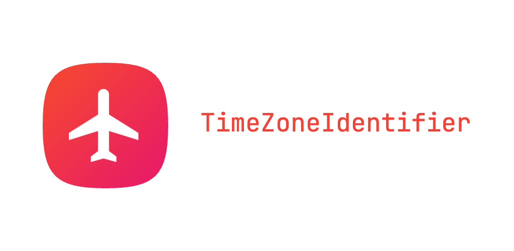

# List of Time Zones Identifiers for Swift 🌍

[](https://swift.org)
[](https://github.com/nzrsky/TimeZoneIdentifier/blob/main/LICENSE)

[](https://img.shields.io/cocoapods/v/TimeZoneIdentifier.svg)
[](https://github.com/Carthage/Carthage)

[](https://github.com/nzrsky/TimeZoneIdentifier/actions/workflows/build-test.yml?query=branch%3Amain+)
[](https://codecov.io/gh/nzrsky/TimeZoneIdentifier)
[](https://nzrsky.github.io/TimeZoneIdentifier)

[]()
[]()


<div align="center">
  
</div>

## Overview

This Swift library provides a convenient way to handle time zones through the `TimeZoneConvertible` protocol and the `TimeZoneIdentifier` enum. Whether you need the current system time zone, an auto-updating time zone, or specific global time zones, this library has got you covered.

## Features

- Type-safe time zone identifiers.
- Extendable `TimeZoneConvertible` protocol.
- Easy-to-use, Swifty API.

## Automatic Updates 🔄

This library is set up with GitHub Actions to automatically update the list of time zone identifiers every day. The updates are compatible across all iOS versions.

The workflow ensures that the list stays current, and any changes are committed directly to the repository. Only the differences (diff) are committed, ensuring that the change history remains clean and easy to follow.
  
## Installation

### Swift Package Manager

Add the package dependency to your `Package.swift` file:

```swift
dependencies: [
    .package(url: "https://github.com/nzrsky/TimeZoneIdentifier.git", from: "1.0.0")
]
```

Then run:

```bash
swift build
```

## Usage
First, import the module:

```swift
import TimeZoneIdentifiers
```

### Using TimeZoneConvertible
You can use the TimeZoneConvertible protocol to seamlessly convert between types:

```swift
let timeZone: TimeZone = TimeZoneIdentifier.current.timezone()
```

### Using TimeZoneIdentifier Enum
The TimeZoneIdentifier enum allows you to easily access different time zones:

```swift
let currentZone = TimeZoneIdentifier.current.timezone()
let autoUpdatingZone = TimeZoneIdentifier.autoUpdating.timezone()
let specificZone = TimeZoneIdentifier.africaAbidjan.timezone()
```

## Contributing
Pull requests are welcome. For major changes, please open an issue first to discuss what you would like to change.

## License
This project is licensed under the MIT License. See the LICENSE file for details.

Made in 🇱🇻 by Alex Nazarov